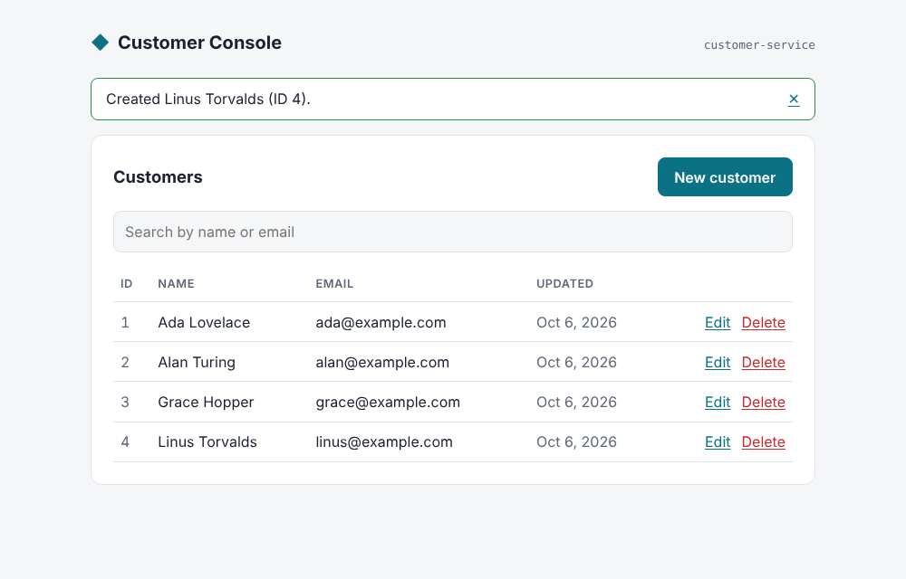
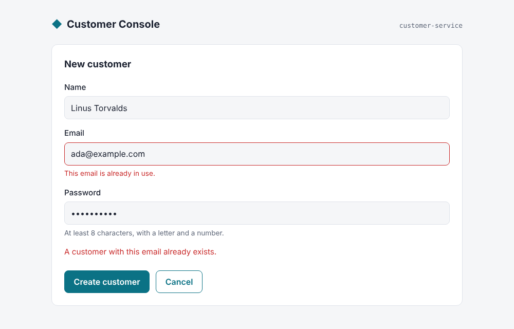
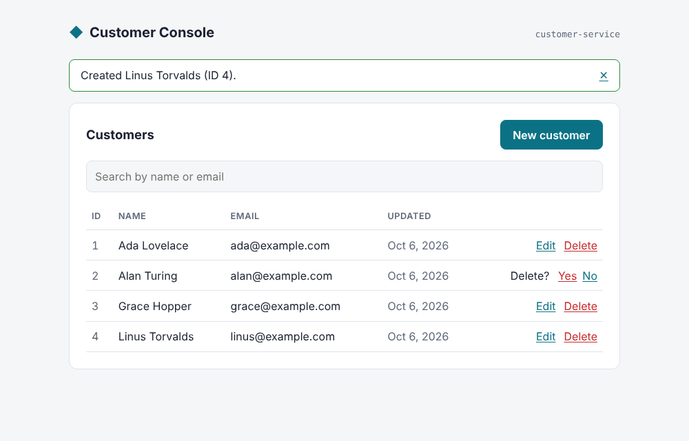

# Microservice Example: Customer Service

[](https://github.com/imkarthiknr/Microservice-example/actions/workflows/ci.yml)


A **three-tier microservice example**:

- an **Angular** admin console (presentation tier)
- an independently deployable **customer-service** REST API built on Express (business tier)
- a **SQLite** database owned by that service (data tier)

The stack is containerised with **Docker Compose**: nginx serves the SPA and reverse-proxies `/api` to the service.

The project began in 2020 as a college exercise ("ThreetierObservable") in Angular `HttpClient` and RxJS Observables against a customer API. In 2026 it was rebuilt into a documented, tested, containerised monorepo. [CHANGELOG.md](CHANGELOG.md) has the history.

| Customers                                   | Create / edit with validation                           | Delete confirmation                                  |
| ------------------------------------------- | ------------------------------------------------------- | ---------------------------------------------------- |
|  |  |  |

## Architecture

```
                    ┌──────────────────────── docker compose ────────────────────────┐
┌─────────┐  :8080  │ ┌───────────────────────┐  /api/*  ┌──────────────────────────┐ │
│ Browser │ ──────▶ │ │ web                   │ ───────▶ │ customer-service  :6102  │ │
└─────────┘         │ │ nginx + Angular SPA   │          │ Express 5                │ │
                    │ └───────────────────────┘          │  routes → repository     │ │
                    │                                    └────────────┬─────────────┘ │
                    │                                                 │ node:sqlite   │
                    │                                       ┌─────────▼─────────┐     │
                    │                                       │ customer-data vol │     │
                    │                                       │ customers.db      │     │
                    │                                       └───────────────────┘     │
                    └─────────────────────────────────────────────────────────────────┘
```

Microservice traits this example demonstrates:

- **Database per service.** Only `customer-service` touches the customer data, through a repository layer.
- **Single origin.** The browser only talks to nginx, so no CORS is needed and the service is not exposed on the host.
- **Health checks.** `GET /health` checks the database. Docker uses it, and Compose starts `web` only after the service is healthy.
- **Twelve-factor configuration** through environment variables.
- **Graceful shutdown.** On `SIGTERM` the service drains in-flight requests, then closes the database.
- **Structured JSON request logs** written to stdout.
- **Stateless containers** with persistent data in a named volume.

## Features

- Customer **CRUD**: a list with debounced search, create, edit (password optional) and delete with inline confirmation.
- **Validation on both sides.** Server field errors (such as a duplicate email) appear inline on the matching form field.
- **Passwords** are hashed with salted `scrypt` and never returned by the API.
- **Modern Angular**: standalone components, signals, zoneless change detection, lazy routes, and route params bound to component inputs.
- **Tests and CI.** 44 tests (Vitest, `node:test`, Supertest). CI also builds the Docker images and smoke-tests the running stack end to end.

## Quick start

### Option A: Docker (one command)

```bash
git clone https://github.com/imkarthiknr/Microservice-example.git
cd Microservice-example
docker compose up --build
```

Open <http://localhost:8080>. Three demo customers are seeded on first start.

### Option B: Local Node.js (hot reload)

You need Node.js **22.13+** or **24+**.

```bash
npm install       # root tooling
npm run setup     # installs service + frontend dependencies
npm run dev       # customer-service on :6102, console on :4200
```

Open <http://localhost:4200>.

## Project structure

```
Microservice-example/
├── services/
│   └── customer-service/        Express REST API (business + data tier)
│       ├── src/
│       │   ├── server.js        Bootstrap: config, DB, seed, graceful shutdown
│       │   ├── app.js           App factory: middleware, /health, error handling
│       │   ├── routes/customers.js   /api/customers resource
│       │   ├── customer-repository.js  SQL access, row mapping
│       │   ├── db.js            node:sqlite connection + schema
│       │   ├── validation.js    Payload rules
│       │   ├── password.js      scrypt hashing
│       │   └── config.js        Environment variables
│       ├── test/                node:test + Supertest
│       └── Dockerfile
├── frontend/                    Angular console (presentation tier)
│   ├── src/app/
│   │   ├── core/                Models, CustomerService, NotificationService, error mapping
│   │   ├── features/
│   │   │   ├── customer-list/   Table, search, delete
│   │   │   └── customer-form/   Create + edit
│   │   └── shared/validators/
│   ├── nginx.conf               SPA hosting + /api reverse proxy
│   ├── proxy.conf.json          Dev proxy → :6102
│   └── Dockerfile
├── docs/                        API reference, screenshots
├── docker-compose.yml
├── .github/workflows/ci.yml
├── DEVELOPMENT.md
└── CONTRIBUTING.md
```

## API at a glance

| Method   | Endpoint                         | Description                            |
| -------- | -------------------------------- | -------------------------------------- |
| `GET`    | `/health`                        | Liveness/readiness (includes DB check) |
| `GET`    | `/api/customers?search=`         | List customers, optionally filtered    |
| `GET`    | `/api/customers/:id`             | Get one customer                       |
| `POST`   | `/api/customers`                 | Create → `201`                         |
| `PUT`    | `/api/customers/:id`             | Update (password optional)             |
| `DELETE` | `/api/customers/:id`             | Delete → `204`                         |

The full reference is in [docs/API.md](docs/API.md).

## Scripts

Run these from the repository root:

| Command                | What it does                                       |
| ---------------------- | -------------------------------------------------- |
| `npm run setup`        | Install service and frontend dependencies          |
| `npm run dev`          | Run service and console with live reload           |
| `npm test`             | Run all tests                                      |
| `npm run build`        | Production build of the console                    |
| `npm run docker:up`    | `docker compose up --build -d`                     |
| `npm run docker:down`  | Stop the stack                                     |

[DEVELOPMENT.md](DEVELOPMENT.md) covers configuration, architecture decisions, testing and troubleshooting.

## Limitations

This is a learning and portfolio project. There is **no authentication** on the API or console, and SQLite with a single service instance is not a horizontally scalable setup. The roadmap in [DEVELOPMENT.md](DEVELOPMENT.md#roadmap) covers the next steps.

## Contributing

Issues and pull requests are welcome. See [CONTRIBUTING.md](CONTRIBUTING.md).

## License

[MIT](LICENSE) © Karthik N R
